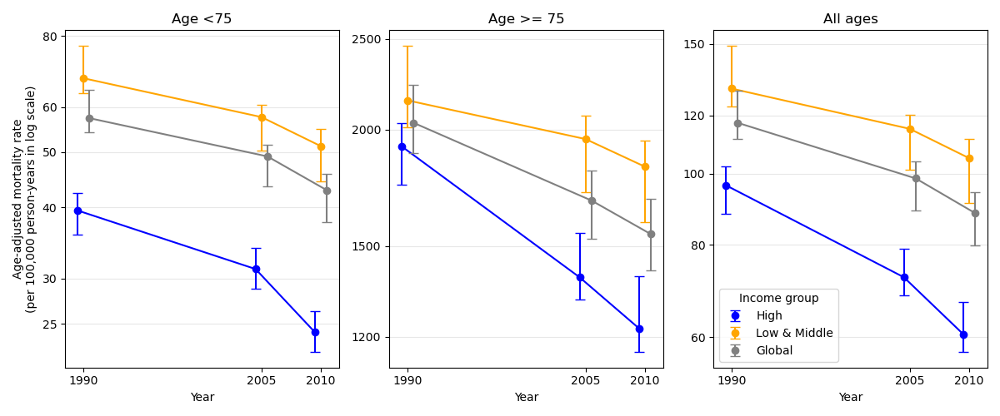

# HW 1

## Make a graph of the mortality values (by age group, year, and country income group). Focus on the rates and intervals. The data are available in feigin2014_table1_mortality.csv.



## Discuss your design choices. (Why did you choose this particular graph?)

I used a line and point plot with one panel per age group. Each point is the age adjusted mortality rate for one income group in one year, and each point has error bars that show the 95% CI around the estimate. Lines connect the points across years to show the trend (slope) between the years. Each income group appears in every age group panel, and different colors show which income group is which. The x-axis uses actual years, so the 15 year and 5 year gaps appear at their true length. Within each year, I shifted the points slightly left or right so the error bars do not overlap. The figure shows that mortality fell in every group from 1990 to 2010, and high income rates fell faster than low and middle income rates in every age group.

Mortality rates in the >=75 group are about 50x higher than in the other age groups. Using a shared y-axis would flatten the <75 and all ages panels, so I gave each panel its own y-axis. Using separate linear axes would make slopes incomparable across panels, since each slope would depend on that panel's axis range. Instead I used a log scale, so the slopes show percent change instead of absolute change. On a log scale, the same percent drop covers the same vertical distance no matter where it starts. For example, a drop from 40 to 30 looks as tall as a drop from 2000 to 1500, since both are 25% drops. This helps makes the slopes comparable across panels. The tick labels show actual values (the mortality rates log adjusted), not the 10^x values, to make the axis easier to read.

## How would you make a comprehensive graph that includes all of the information in the table (the additional outcomes incidence, prevalence, MIR, and DALYs lost)?

I would extend my mortality figure into many grid of panels so I would have 15 panels. Each row would be one outcome (incidence, prevalence, MIR, DALYs lost, and mortality), and each column would be one age group (<75, >=75, and all ages). Every panel would use the same design as the mortality figure; points for the estimates, error bars for the 95% CIs, lines connecting the years, color for income group, and actual years on the x-axis. I would also keep the log scale; equal slopes would mean equal percent change across age groups and outcomes, so a reader could compare slopes across all of the panels. This way, once a reader understands one panel, they can hopefully read all of them.

### Appendix (Code used)

```python
import pandas as pd
import matplotlib.pyplot as plt

df = pd.read_csv("feigin2014_table1_mortality.csv", sep=",", header=0)

age_groups = ["<75", ">=75", "all"]
titles = ["Age <75", "Age >= 75", "All ages"]
years = [1990, 2005, 2010]
income_groups = ["high", "low_and_middle", "all"]
labels = ["High", "Low & Middle", "Global"]
colors = ["blue", "orange", "gray"]
shifts = [-0.5, 0, 0.5] # small x-shift (in years) so error bars don't completely overlap
ticks = [20, 25, 30, 40, 50, 60, 80, 100, 120, 150, 1000, 1200, 1500, 2000, 2500, 3000] # used for the log scale (got from looking a the scales in 10^x form)

fig, axes = plt.subplots(1, 3, figsize=(12, 5))

for ax, age, title in zip(axes, age_groups, titles):
    for inc, label, color, shift in zip(income_groups, labels, colors, shifts):
        d = df[(df["age_group"] == age) & (df["income_group"] == inc)]
        x = d["year"] + shift
        y = d["mortality_rate"]
        lower = y - d["interval_low"] # distance from mortality_rate down to interval_low
        upper = d["interval_high"] - y  # distance from mortality_rate up to interval_high
        ax.plot(x, y, color=color)
        ax.errorbar(x, y, yerr=[lower, upper], fmt="o", color=color,
                    markerfacecolor=color, capsize=4, label=label)
        
    # log y-axis with plain-number tick labels (instead of 10^x)
    ax.set_yscale("log")
    ax.set_yticks(ticks, labels=ticks) # ticks outside a panel's range are skipped
    ax.minorticks_off()            
    ax.autoscale(axis="y") # shrink the axis back to this panel's data

    ax.set_title(title)
    ax.set_xticks(years)
    ax.set_xlabel("Year")
    ax.grid(axis="y", alpha=0.3)

axes[0].set_ylabel("Age-adjusted mortality rate\n(per 100,000 person-years in log scale)")
axes[-1].legend(title="Income group")
fig.tight_layout()
plt.savefig("figure.png")
```